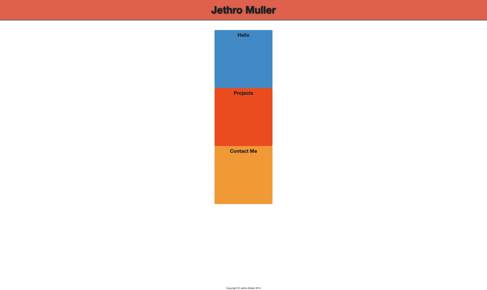
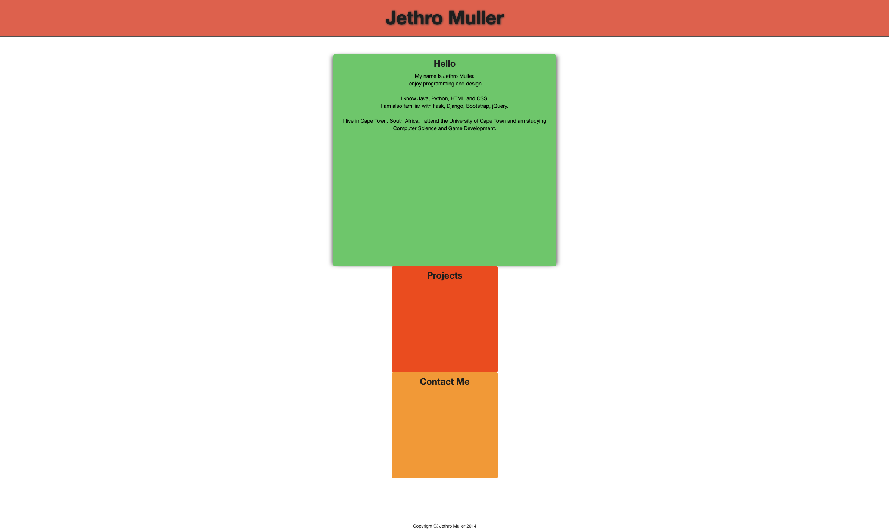
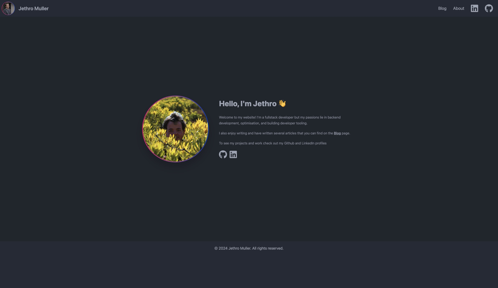
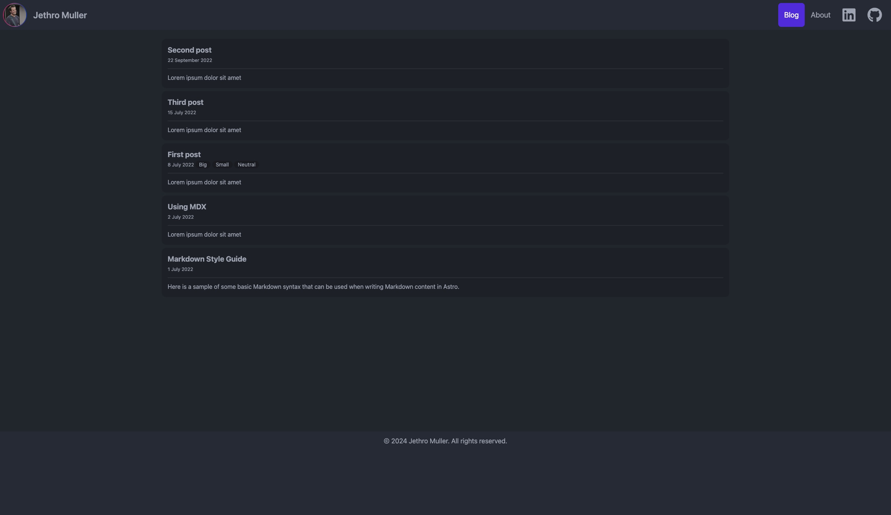
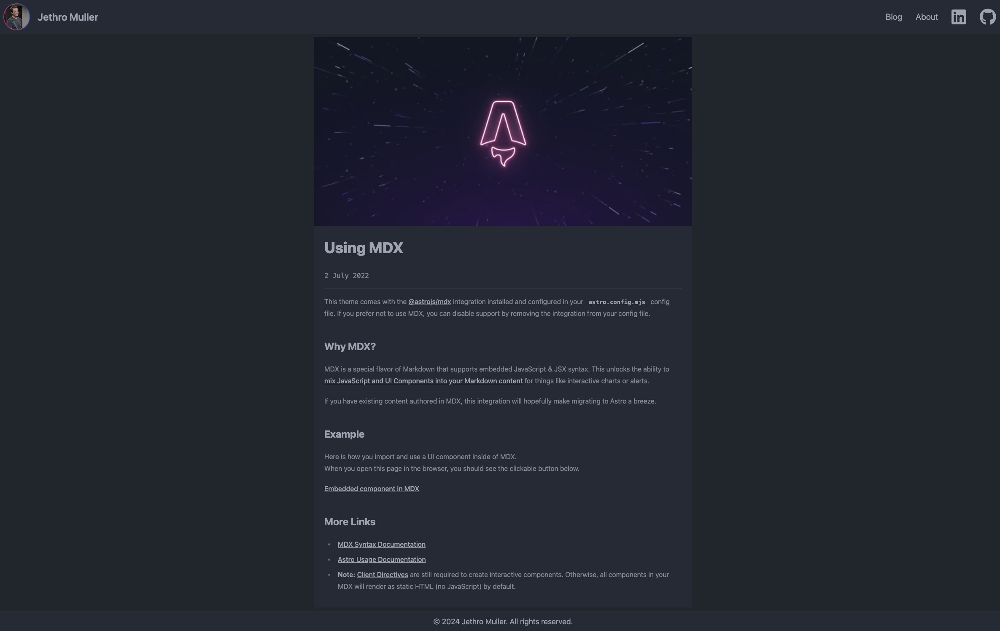

I finally got around to building my new website.

I had attempted this around two years ago too, also using Astro, but I tried to build everything
from scratch. I got quite far, but I didn't know enough to actually finish that rewrite.

This time I was smarter! I used a template!

More specifically, I used the [Astrofy](https://github.com/manuelernestog/astrofy) template from
[Manuel Ernesto Garcia](https://github.com/manuelernestog).

I got to skip all the hard parts of making the disparate components and ideas fit together and
really quickly too.

I spent most of the first day setting up the project getting everything the way I like it with
eslint and prettier setup to make sure I keep my site clean from the start. I also added stricter
type rules to make sure I could statically check I wasn't doing anything silly with the internal
components.

First lets look at the original website.

I made this in 2014 while I was in my second year of university at the University of Cape Town.
I had just found out about CSS transitions and wanted to make a dynamic website without using
JavaScript. I used transitions on hover to make the blocks expand and changed the text colour, so
it would be visible.

I thought this website was great back then and haven't really had any reason to change it since.
Friends of mine have regularly asked why it still looked like that and I didn't have a great answer
but updating it seemed like a big ask when I hadn't gone much further with my frontend design skills.

Ultimately, it seemed now was the right time to do it. It's been 10 years and I've come so far. It
felt weird having something so outdated representing me online.

I had tried to make a new website two years ago just after I joined [Stitch](https://stitch.money).
I had finally learned how to use all the fancy new JavaScript tooling and had read about [Astro](https://astro.build)
which got me really excited.

Here's a few screenshots of the version of the site I made two years ago

It's not as bad as I remember it being. It's even decently responsive which is all
thanks to [DaisyUI](https://daisyui.com/) and [TailwindCSS](https://tailwindcss.com) which
are both used on this site and as part of this template.

Ultimately, I think it's fun to look back on what I built two years ago and to see how much
I've grown since then. I've learned so much about the world of TypeScript/JavaScript and all
the associated tooling, and it made creating this website so much simpler. Looking even further back
on the website I made in 2014 it's great to realise how much I've learned, grown, and accomplished
in just 10 years.
