I've been more and more interested in trying out electronics projects since I found out about the
ESP32. It is a low-cost and low-power system on a chip with Wi-Fi and Bluetooth.

It costs around R250 (~13 USD) on local sites for a fully featured ESP32 development board which is
a great price for something that can do so much out of the box.

I bought a 2-pack of the ESP-WROOM-32 boards recently and went through the process of setting them
up on Windows 11. I ran into some rough edges and wanted to collate as much of the information I
used into one place as possible to make it easier for anyone (myself included) to set these up in
the future.

> [!NOTE] Note
> This article assumes you've bought the same board as me but should help you figure out if there
> are any steps you're missing. Where possible I will give more general instructions that should work
> for all boards. **Importantly, this assumes your ESP32 board has a USB port.**

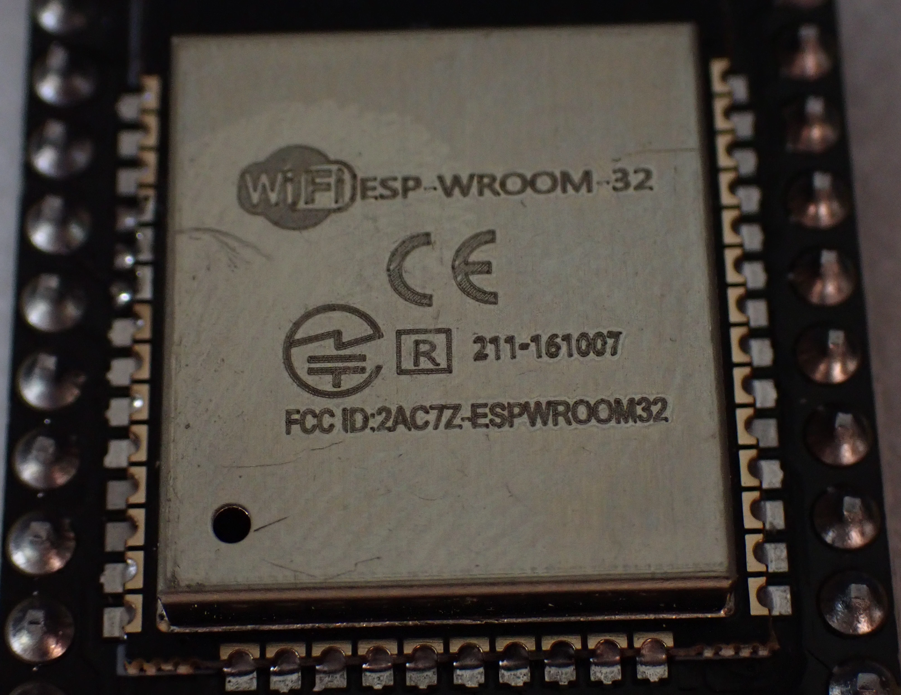

## 1. Setup

There are a few things you need to set up before you can actually get started. You need drivers, a
development environment (unless you are using
the [esptool utility](https://github.com/espressif/esptool) directly), and **very importantly** a
USB cable that supports data connections.

### Drivers

You will most likely need to install drivers for the UART chip that exists on your ESP32 board. In
my case it's a CP2102 USB to UART Bridge Virtual COM Port (VCP).

You should be able to find the name on the little microcontroller near the USB port on your ESP32
board. In the picture below you can see it says `S1LABs CP2102`.

> [!WARNING] Warning
> Apparently it being `S1LABs` instead of `SILABs` indicates that it's a counterfeit CP2102 which
> could cause issues. I have not confirmed this myself.
> "...a counterfeit CP2102 that was leaking 5 volts to the ESP32 (4.05v to the En pin, and 5v to
> Rx). Easy to check for this if you have otherwise inexplicable wifi issues: just measure the
> voltages at En and Rx on the dev board relative to Gnd. They should both be
> 3.3v..." - [/u/brandyn in r/esp32](https://www.reddit.com/r/esp32/comments/17vmyi8/comment/k9bm24t/?utm_source=share&utm_medium=web3x&utm_name=web3xcss&utm_term=1&utm_content=share_button)

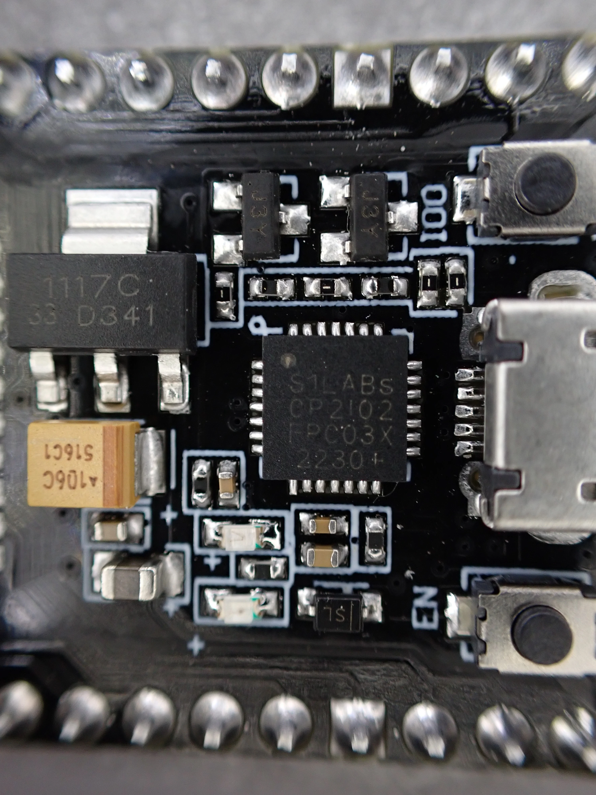

You will need to download the drivers for your specific USB VCP. The drivers for CP210X VCPs can be
found on
the [Silicon Labs download page](https://www.silabs.com/developers/usb-to-uart-bridge-vcp-drivers?tab=downloads).

Download the drivers appropriate for your operating system and install them. In my case I installed
the Windows drivers.

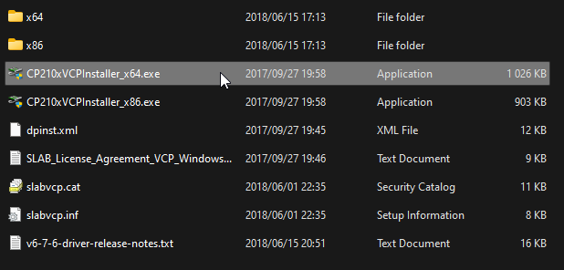

### USB Cable

This was my biggest hurdle. If your USB cable is only made to deliver power and not data you won't
be able to connect to the ESP32 even if it powers on. Try different cables if your first cable
doesn't work.
You should see a new serial port appear in Windows Device Manager when you plug the ESP32 in if you
have correctly set up your drivers.

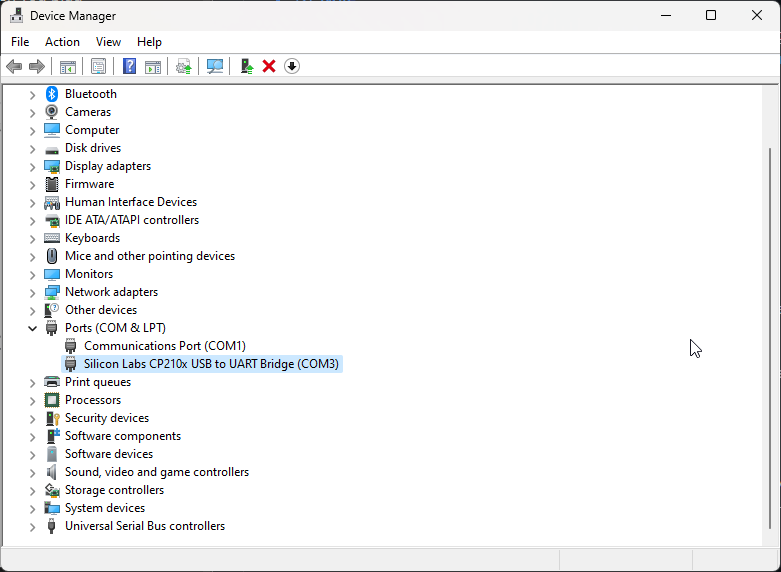

### Development Environments

The two IDE environments I've tested are [VSCodium](https://vscodium.com/) with
the [ESP-IDF extension](https://marketplace.visualstudio.com/items?itemName=espressif.esp-idf-extension)
and the [Arduino IDE](https://www.arduino.cc/en/software) with
the [Arduino Core for ESP32](https://github.com/espressif/arduino-esp32) setup. There is also a
plugin for Jetbrains CLion IDE - the instructions for setting that up can be found in
the [Espressif Docs](https://docs.espressif.com/projects/esp-idf/en/stable/esp32/third-party-tools/clion.html).

Those all have their own dedicated instructions, so I won't replicate those here. Follow their
instructions and you'll be good to go.

#### Arduino IDE

For my particular board I selected `ESP32 Dev Module` and the appropriate COM serial port.

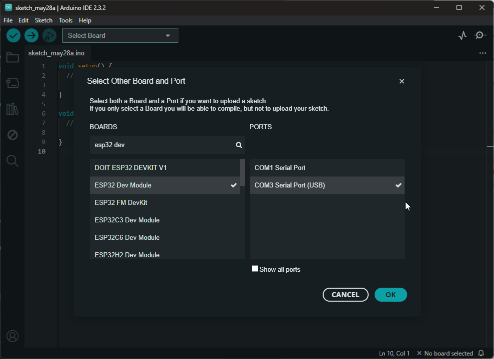

## 2. Running a script

Once you've done all the setup steps and have successfully gotten your ESP32 connected to your
computer via USB with the correct drivers installed it's time to run some code.

### Setting the correct boot mode

There is one more thing to know when pushing code to the ESP32 (at least for the ESP32 boards I
have).

If you encounter this error message you should follow the instructions in the
espressif [ESP32 documentation for manually putting your ESP32 into Firmware Download mode](https://docs.espressif.com/projects/esptool/en/latest/esp32/advanced-topics/boot-mode-selection.html#manual-bootloader).

> [!ERROR] Error Message
> Failed to connect to ESP32: Wrong boot mode detected (0x13)! The chip needs to be in download
> mode.

In practice what you need to do if you are encountering this error is to:

1. Hold down the `Boot` button (see the diagram at the link below for reference)
2. Press the `EN` button (Reset button)
3. Click `Upload` in Arduino IDE or `Flash Device` in VSCodium
4. Once you see `Connecting...` you can let go of the `Boot` button

The buttons are on either side of the USB port on my board as show in the example image in
the [ESP-IDF documentation](https://docs.espressif.com/projects/esp-idf/en/release-v3.0/get-started/get-started-devkitc.html#functional-description).

There are other ways to do this described in
the [`Boot Mode Selection`](https://docs.espressif.com/projects/esptool/en/latest/esp32s3/advanced-topics/boot-mode-selection.html)
documentation, but I haven't tried any of those as they require jumping pins or adding other
electronic components.

### Running a script

Now that we've covered how to correctly enter download mode, so we can upload code to the ESP32 we
can try out an example. For this, I'm using the provided `Get Mac Address` example in the Arduino
IDE.

First, ensure you have selected the ESP32 Dev Module from the dropdown to get access to the ESP32
examples. Select the example
from `File` -> `Examples` -> `ESP32` -> `MacAddress` -> `GetMacAddress`.

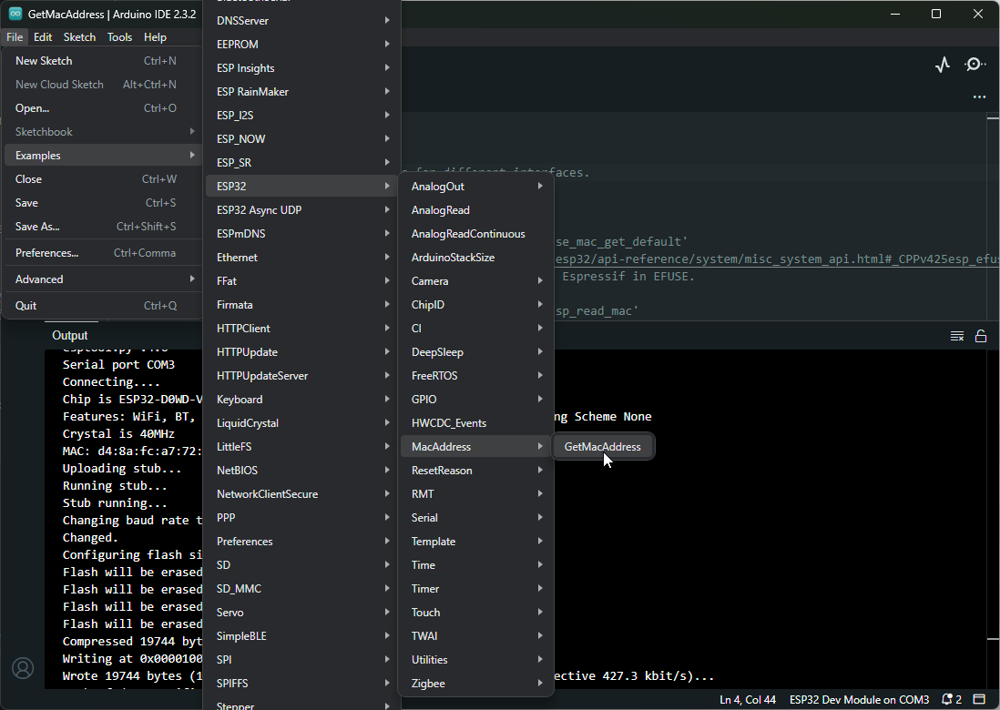

Once that's loaded ensure your ESP32 is still selected from the dropdown and click `Upload`

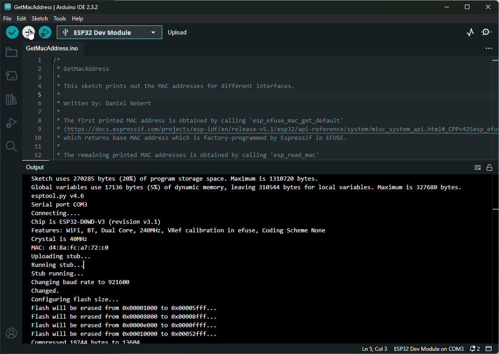

If all has gone well you should see the output like the output I got in the image above. If you get
any errors searching the error codes has helped me find solutions for most of my problems so far.
You will notice, that there is no output from the ESP32. To see that in this case, we need to
monitor the serial output using the `Serial Monitor` tool at `Tools` -> `Serial Monitor`.

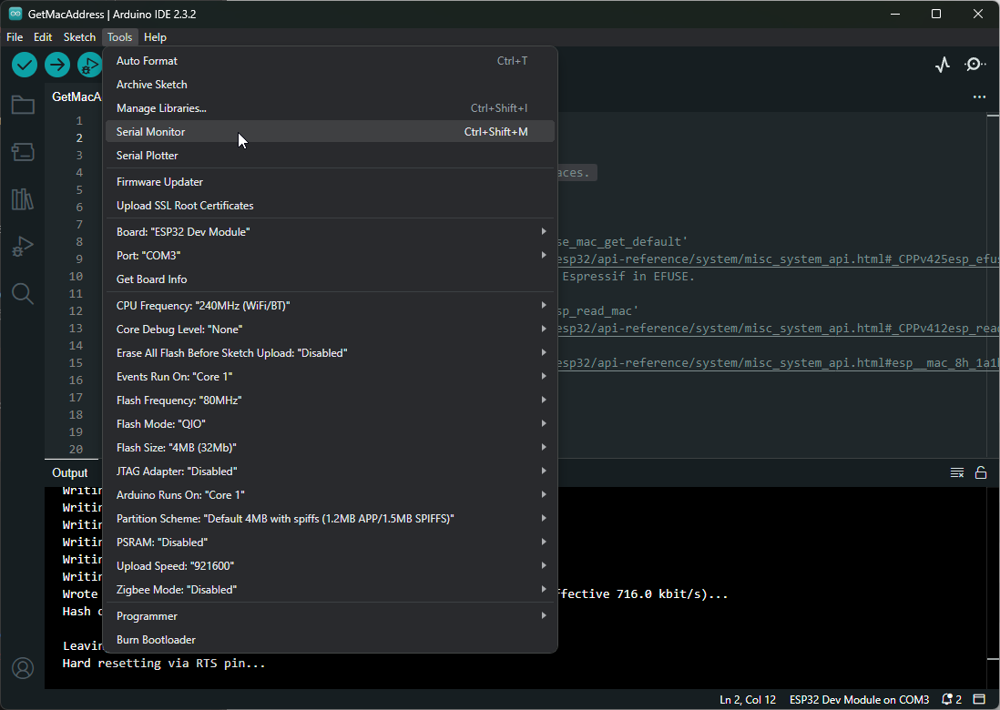

This opens the serial monitor, and you will want to make sure it's set to 115200 baud in most cases.
I'm not sure how to check the exact setting for each version of the ESP32 boards but this seemed to
be the general advice online.

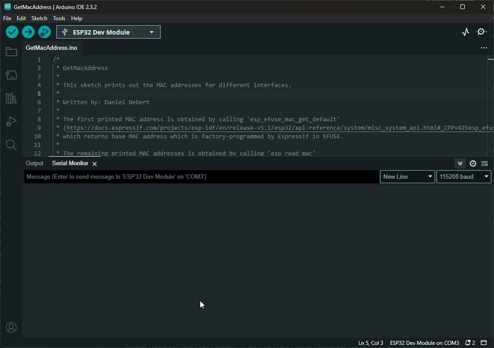

Again, there is no output. To run the example code we uploaded we need to press the `EN` button on
the ESP32 board. This will reset the ESP32 which will make it run the code we loaded again, and we
can see the output in the serial monitor pane.

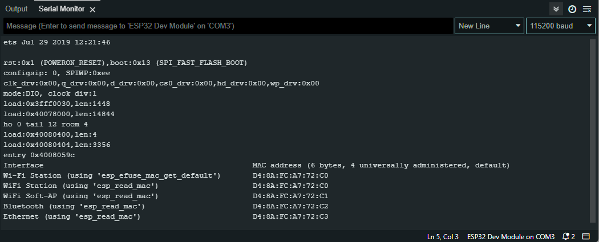

## 3. Simulation

If you don't have access to an ESP32 or are worried about breaking your electronics another option I
found is to use a simulation environment. The one I've tried is called [Wowki](https://wokwi.com/).

They
have [IDE support for CLion and RustRover](https://plugins.jetbrains.com/plugin/23826-wokwi-simulator)
and [VSCode](https://docs.wokwi.com/vscode/getting-started) as well
as [continuous integration environments](https://docs.wokwi.com/wokwi-ci/getting-started) like
GitHub Actions. The way I tried it was via their web interface. It was a fun way to follow along
with a tutorial I had found online to learn more about the various pins on the ESP32 and how to use
them.

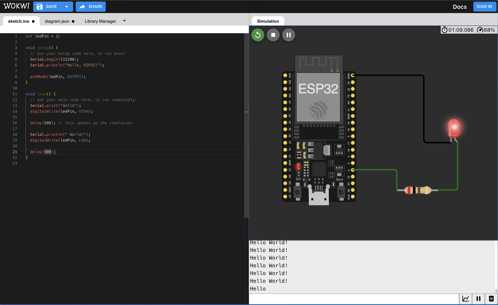

## Conclusion

Setting up these boards required a bit more than I expected but now that they're working the example
scripts alone show off how much each board is capable of. Having Wi-Fi and Bluetooth opens up a
number of cool applications for such tiny boards.

My current plan is to use them for monitoring sensors that can report in to Home Assistant or
alongside my planned 3D printer enclosure.
